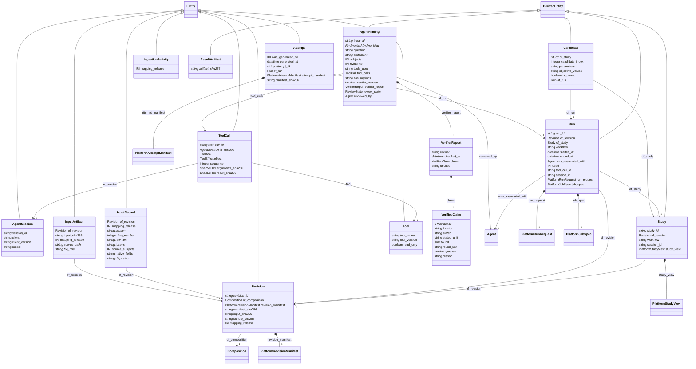

# analysis

Model revisions, runs, attempts, studies and agent findings. Each curated class embeds the matching hydrocouple.platform contract (generated in analysis_platform.yaml) as its manifest, adds wsys identity and PROV links, and is what other modules reference. Nothing here invents a shape the platform does not publish.

```mermaid
classDiagram
  class AgentFinding {
    string trace_id*
    FindingKind finding_kind*
    string question
    string statement*
    IRI subjects
    IRI evidence
    string tools_used
    ToolCall tool_calls
    string assumptions
    boolean verifier_passed*
    VerifierReport verifier_report
    ReviewState review_state
    Agent reviewed_by
  }
  class AgentSession {
    string session_id*
    string client
    string client_version
    string model
  }
  class Attempt {
    IRI was_generated_by
    datetime generated_at
    string attempt_id*
    Run of_run
    PlatformAttemptManifest attempt_manifest
    string manifest_sha256
  }
  class Candidate {
    Study of_study
    integer candidate_index
    string parameters
    string objective_values
    boolean is_pareto
    Run of_run
  }
  class IngestionActivity {
    IRI mapping_release
  }
  class InputArtifact {
    Revision of_revision
    string input_sha256
    IRI mapping_release
    string source_path*
    string file_role*
  }
  class InputRecord {
    Revision of_revision
    IRI mapping_release
    string section*
    integer line_number*
    string raw_text*
    string tokens*
    IRI source_subjects
    string native_fields
    string disposition*
  }
  class ResultArtifact {
    string artifact_sha256*
  }
  class Revision {
    string revision_id*
    Composition of_composition
    PlatformRevisionManifest revision_manifest
    string manifest_sha256
    string input_sha256
    string bundle_sha256
    IRI mapping_release
  }
  class Run {
    string run_id*
    Revision of_revision
    Study of_study
    string workflow
    datetime started_at
    datetime ended_at
    Agent was_associated_with
    IRI used
    string tool_call_id
    string session_id
    PlatformRunRequest run_request
    PlatformJobSpec job_spec
  }
  class Study {
    string study_id*
    Revision of_revision
    string workflow
    string session_id
    PlatformStudyView study_view
  }
  class Tool {
    string tool_name*
    string tool_version
    boolean read_only
  }
  class ToolCall {
    string tool_call_id*
    AgentSession in_session*
    Tool tool
    ToolEffect effect
    integer sequence
    Sha256Hex arguments_sha256
    Sha256Hex result_sha256
  }
  class VerifiedClaim {
    IRI evidence*
    string locator*
    string stated*
    string stated_unit
    float found
    string found_unit
    boolean passed*
    string reason
  }
  class VerifierReport {
    string verifier*
    datetime checked_at*
    VerifiedClaim claims
    string uncited
  }
  DerivedEntity <|-- AgentFinding
  AgentFinding --> "*" ToolCall : tool_calls
  AgentFinding *-- "1" VerifierReport : verifier_report
  AgentFinding --> "1" Agent : reviewed_by
  Entity <|-- AgentSession
  Entity <|-- Attempt
  Attempt --> "1" Run : of_run
  Attempt *-- "1" PlatformAttemptManifest : attempt_manifest
  DerivedEntity <|-- Candidate
  Candidate --> "1" Study : of_study
  Candidate --> "1" Run : of_run
  Entity <|-- IngestionActivity
  Entity <|-- InputArtifact
  InputArtifact --> "1" Revision : of_revision
  Entity <|-- InputRecord
  InputRecord --> "1" Revision : of_revision
  DerivedEntity <|-- ResultArtifact
  Entity <|-- Revision
  Revision --> "1" Composition : of_composition
  Revision *-- "1" PlatformRevisionManifest : revision_manifest
  DerivedEntity <|-- Run
  Run --> "1" Revision : of_revision
  Run --> "1" Study : of_study
  Run --> "1" Agent : was_associated_with
  Run *-- "1" PlatformRunRequest : run_request
  Run *-- "1" PlatformJobSpec : job_spec
  DerivedEntity <|-- Study
  Study --> "1" Revision : of_revision
  Study *-- "1" PlatformStudyView : study_view
  Entity <|-- Tool
  Entity <|-- ToolCall
  ToolCall --> "1" AgentSession : in_session
  ToolCall --> "1" Tool : tool
  VerifierReport *-- "*" VerifiedClaim : claims
```

## Classes

| Class | Parent | Description |
| --- | --- | --- |
| `AgentFinding` | DerivedEntity | What an agent surfaced to a person, with the trace, tools, evidence and assumptions behind it and the verifier's verdict. Recommendations are proposals only. |
| `AgentSession` | Entity | One session of an AI agent - a client and a model that a person started. The agent that worked in it is was_associated_with, an Agent of kind AI_AGENT that acts on that person's behalf. The platform names the session in the actor of every run it submits. |
| `Attempt` | Entity | One execution attempt of a run with its artifacts, provenance and quality (platform attempt manifest). Simulation results ingested as Observations of result_kind SIMULATION point here through was_generated_by. |
| `Candidate` | DerivedEntity | One evaluated design or policy in a study, with its decision variables and objective values. |
| `IngestionActivity` | Entity | A particular import of a revision under a versioned mapping profile. |
| `InputArtifact` | Entity | A hashed primary input or an external dependency in a revision bundle. |
| `InputRecord` | Entity | An original INP record retained with its line number and ordered native tokens. |
| `ResultArtifact` | DerivedEntity | An output produced by an execution attempt, identified by the digest of its bytes. |
| `Revision` | Entity | An immutable model revision identified by its platform manifest or by a local input bundle and its checksum. Each SWMM element belongs to one revision. |
| `Run` | DerivedEntity | A request to execute a workflow on a revision on a target (platform run request plus the job spec the control plane built from it). |
| `Study` | DerivedEntity | An ask/tell optimisation over an evaluator pool (platform study view): objectives, budget, state and the Pareto set. |
| `Tool` | Entity | A tool an agent can call, as its server registers it. |
| `ToolCall` | Entity | One call an agent made to a tool. The arguments and the result are kept as checksums, not as content. |
| `VerifiedClaim` |  | One number a finding's statement cites, checked against the artifact it cites. |
| `VerifierReport` |  | The verifier's account of a finding - each cited number, where it was looked up and what was found there. |
