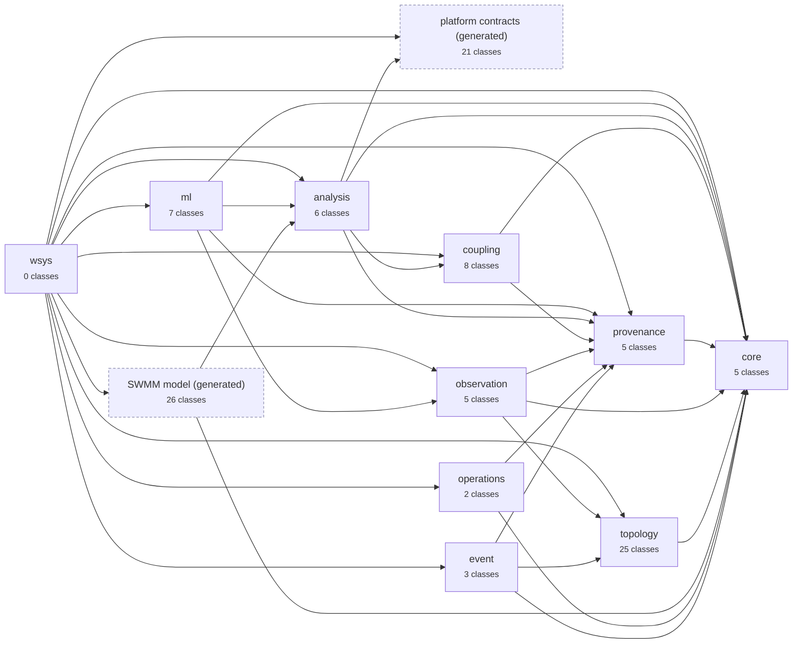

# Module map

Each module is one LinkML file; arrows are `imports`. Generated modules are regenerated from vendored inputs, never edited.

```mermaid
flowchart LR
  wsys["wsys<br/><small>0 classes</small>"]
  wsys_ml["ml<br/><small>7 classes</small>"]
  wsys_analysis["analysis<br/><small>6 classes</small>"]
  wsys_analysis_platform["platform contracts (generated)<br/><small>21 classes</small>"]:::gen
  wsys_coupling["coupling<br/><small>8 classes</small>"]
  wsys_provenance["provenance<br/><small>5 classes</small>"]
  wsys_core["core<br/><small>5 classes</small>"]
  wsys_observation["observation<br/><small>5 classes</small>"]
  wsys_topology["topology<br/><small>25 classes</small>"]
  wsys_model["SWMM model (generated)<br/><small>26 classes</small>"]:::gen
  wsys_operations["operations<br/><small>2 classes</small>"]
  wsys_event["event<br/><small>3 classes</small>"]
  wsys --> wsys_core
  wsys --> wsys_provenance
  wsys --> wsys_topology
  wsys --> wsys_observation
  wsys --> wsys_event
  wsys --> wsys_operations
  wsys --> wsys_coupling
  wsys --> wsys_analysis_platform
  wsys --> wsys_analysis
  wsys --> wsys_model
  wsys --> wsys_ml
  wsys_ml --> wsys_core
  wsys_ml --> wsys_provenance
  wsys_ml --> wsys_observation
  wsys_ml --> wsys_analysis
  wsys_analysis --> wsys_core
  wsys_analysis --> wsys_provenance
  wsys_analysis --> wsys_coupling
  wsys_analysis --> wsys_analysis_platform
  wsys_coupling --> wsys_core
  wsys_coupling --> wsys_provenance
  wsys_provenance --> wsys_core
  wsys_observation --> wsys_core
  wsys_observation --> wsys_provenance
  wsys_observation --> wsys_topology
  wsys_topology --> wsys_core
  wsys_model --> wsys_core
  wsys_model --> wsys_analysis
  wsys_operations --> wsys_core
  wsys_operations --> wsys_provenance
  wsys_event --> wsys_core
  wsys_event --> wsys_provenance
  wsys_event --> wsys_topology
  classDef gen fill:#eef,stroke:#88a,stroke-dasharray: 4 3;
```
